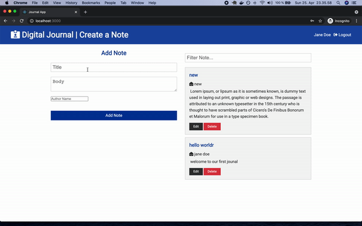

# Journal App 

## Overview

This app was created for the Chingu Voyage 30 pre-work. More Information: Tier 3 solo project https://github.com/chingu-voyages/soloproject-tier3-journal-app

## Live Link: https://murmuring-everglades-98052.herokuapp.com/ 
## How to run
- clone the repo
- npm install
- cd client && npm install
- cd ..
- rename sample.json to default.json or production.json and add your mongodb url
- npm run dev

## Tech Used / Dependencies
React, Express, NodeJS, MongoDB

## Functionality

- Backend: Implementing user authentication
  - [ ] A signup route to allow users to create an app account (e.g. user
  name & password) for themselves
  - [ ] A login route to allow users who have completed the signup process
  to login to the application
- Frontend: Implementing the necessary functionality for each component. Users
are be able to:
  - [ ] signup to create an app-specific account
  - [ ] login to use the app
  - [ ] post a new notes to the list of previously entered notes
  - [ ] modify previously added notes
  - [ ] delete previously entered notes
  - [ ]  Application secrets and user credentials are not stored or
left exposed in the browser

### Demo : 
